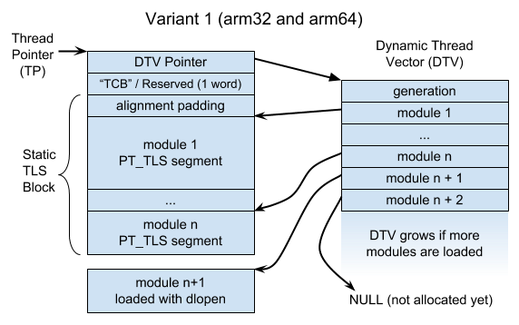
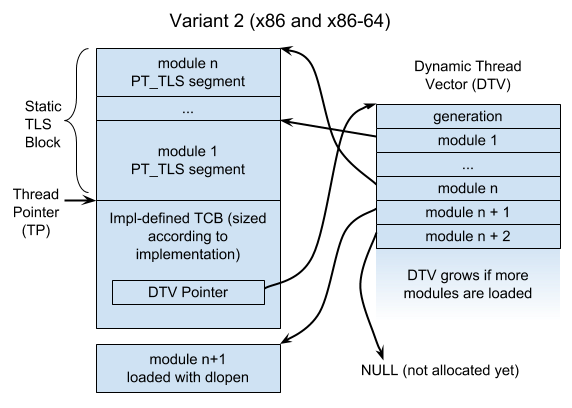
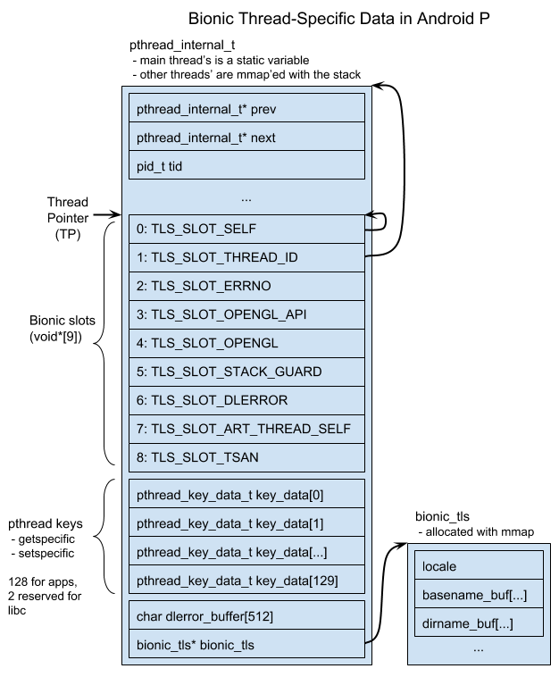

# Android ELF TLS (Draft)

Internal links:
 * [go/android-elf-tls](http://go/android-elf-tls)
 * [One-pager](https://docs.google.com/document/d/1leyPTnwSs24P2LGiqnU6HetnN5YnDlZkihigi6qdf_M)
 * Tracking bugs: http://b/110100012, http://b/78026329

[TOC]

# Overview

ELF TLS is a system for automatically allocating thread-local variables with cooperation among the
compiler, linker, dynamic loader, and libc.

Thread-local variables are declared in C and C++ with a specifier, e.g.:

```cpp
thread_local int tls_var;
```

At run-time, TLS variables are allocated on a module-by-module basis, where a module is a shared
object or executable. At program startup, TLS for all initially-loaded modules comprises the "Static
TLS Block". TLS variables within the Static TLS Block exist at fixed offsets from an
architecture-specific thread pointer (TP) and can be accessed very efficiently -- typically just a
few instructions. TLS variables belonging to dlopen'ed shared objects, on the other hand, may be
allocated lazily, and accessing them typically requires a function call.

# Thread-Specific Memory Layout

Ulrich Drepper's ELF TLS document specifies two ways of organizing memory pointed at by the
architecture-specific thread-pointer ([`__get_tls()`] in Bionic):





Variant 1 places the static TLS block after the TP, whereas variant 2 places it before the TP.
According to Drepper, variant 2 was motivated by backwards compatibility, and variant 1 was designed
for Itanium. The choice has effects on the toolchain, loader, and libc. In particular, when linking
an executable, the linker needs to know where an executable's TLS segment is relative to the TP so
it can correctly relocate TLS accesses. Both variants are incompatible with Bionic's current
thread-specific data layout, but variant 1 is more problematic than variant 2.

Each thread has a "Dynamic Thread Vector" (DTV) with a pointer to each module's TLS block (or NULL
if it hasn't been allocated yet). If the executable has a TLS segment, then it will always be module
1, and its storage will always be immediately after (or before) the TP. In variant 1, the TP is
expected to point immediately at the DTV pointer, whereas in variant 2, the DTV pointer's offset
from TP is implementation-defined.

The DTV's "generation" field is used to lazily update/reallocate the DTV when new modules are loaded
or unloaded.

[`__get_tls()`]: https://android.googlesource.com/platform/bionic/+/7245c082658182c15d2a423fe770388fec707cbc/libc/private/__get_tls.h

# Access Models

When a C/C++ file references a TLS variable, the toolchain generates instructions to find its
address using a TLS "access model". The access models trade generality against efficiency. The four
models are:

 * GD: General Dynamic (aka Global Dynamic)
 * LD: Local Dynamic
 * IE: Initial Exec
 * LE: Local Exec

A TLS variable may be in a different module than the reference.

## General Dynamic (or Global Dynamic) (GD)

A GD access can refer to a TLS variable anywhere. To access a variable `tls_var` using the
"traditional" non-TLSDESC design described in Drepper's TLS document, the toolchain compiler emits a
call to a `__tls_get_addr` function provided by libc.

For example, if we have this C code in a shared object:

```cpp
extern thread_local char tls_var;
char* get_tls_var() {
  return &tls_var;
}
```

The toolchain generates code like this:

```cpp
struct TlsIndex {
  long module; // starts counting at 1
  long offset;
};

char* get_tls_var() {
  static TlsIndex tls_var_idx = { // allocated in the .got
    R_TLS_DTPMOD(tls_var), // dynamic TP module ID
    R_TLS_DTPOFF(tls_var), // dynamic TP offset
  };
  return __tls_get_addr(&tls_var_idx);
}
```

`R_TLS_DTPMOD` is a dynamic relocation to the index of the module containing `tls_var`, and
`R_TLS_DTPOFF` is a dynamic relocation to the offset of `tls_var` within its module's `PT_TLS`
segment.

`__tls_get_addr` looks up `TlsIndex::module`'s entry in the DTV and adds `TlsIndex::offset` to the
module's TLS block. Before it can do this, it ensures that the module's TLS block is allocated. A
simple approach is to allocate memory lazily:

1. If the current thread's DTV generation count is less than the current global TLS generation, then
   `__tls_get_addr` may reallocate the DTV or free blocks for unloaded modules.

2. If the DTV's entry for the given module is `NULL`, then `__tls_get_addr` allocates the module's
   memory.

If an allocation fails, `__tls_get_addr` calls `abort` (like emutls).

musl, on the other, preallocates TLS memory in `pthread_create` and in `dlopen`, and each can report
out-of-memory.

## Local Dynamic (LD)

LD is a specialization of GD that's useful when a function has references to two or more TLS
variables that are both part of the same module as the reference. Instead of a call to
`__tls_get_addr` for each variable, the compiler calls `__tls_get_addr` once to get the current
module's TLS block, then adds each variable's DTPOFF to the result.

For example, suppose we have this C code:

```cpp
static thread_local int x;
static thread_local int y;
int sum() {
  return x + y;
}
```

The toolchain generates code like this:

```cpp
int sum() {
  static TlsIndex tls_module_idx = { // allocated in the .got
    // a dynamic relocation against symbol 0 => current module ID
    R_TLS_DTPMOD(NULL),
    0,
  };
  char* base = __tls_get_addr(&tls_module_idx);
  // These R_TLS_DTPOFF() relocations are resolved at link-time.
  int* px = base + R_TLS_DTPOFF(x);
  int* py = base + R_TLS_DTPOFF(y);
  return *px + *py;
}
```

(XXX: LD might be important for C++ `thread_local` variables -- even a single `thread_local`
variable with a dynamic initializer has an associated TLS guard variable.)

## Initial Exec (IE)

If the variable is part of the Static TLS Block (i.e. the executable or an initially-loaded shared
object), then its offset from the TP is known at load-time. The variable can be accessed with a few
loads.

Example: a C file for an executable:

```cpp
// tls_var could be defined in the executable, or it could be defined
// in a shared object the executable links against.
extern thread_local char tls_var;
char* get_addr() { return &tls_var; }
```

Compiles to:

```cpp
// allocated in the .got, resolved at load-time with a dynamic reloc.
// Unlike DTPOFF, which is relative to the start of the module’s block,
// TPOFF is directly relative to the thread pointer.
static long tls_var_gotoff = R_TLS_TPOFF(tls_var);

char* get_addr() {
  return (char*)__get_tls() + tls_var_gotoff;
}
```

## Local Exec (LE)

LE is a specialization of IE. If the variable is not just part of the Static TLS Block, but is also
part of the executable (and referenced from the executable), then a GOT access can be avoided. The
IE example compiles to:

```cpp
char* get_addr() {
  // R_TLS_TPOFF() is resolved at (static) link-time
  return (char*)__get_tls() + R_TLS_TPOFF(tls_var);
}
```

## Selecting an Access Model

The compiler selects an access model for each variable reference using these factors:
 * The absence of `-fpic` implies an executable, so use IE/LE.
 * Code compiled with `-fpic` could be in a shared object, so use GD/LD.
 * The per-file default can be overridden with `-ftls-model=<model>`.
 * Specifiers on the variable (`static`, `extern`, ELF visibility attributes).
 * A variable can be annotated with `__attribute__((tls_model(...)))`. Clang may still use a more
   efficient model than the one specified.

# Shared Objects with Static TLS

Shared objects are sometimes compiled with `-ftls-model=initial-exec` (i.e. "static TLS") for better
performance. On Ubuntu, for example, `libc.so.6` and `libOpenGL.so.0` are compiled this way. Shared
objects using static TLS can't be loaded with `dlopen` unless libc has reserved enough surplus
memory in the static TLS block. glibc reserves a kilobyte or two (`TLS_STATIC_SURPLUS`) with the
intent that only a few core system libraries would use static TLS. Non-core libraries also sometimes
use it, which can break `dlopen` if the surplus area is exhausted. See:
 * https://bugzilla.redhat.com/show_bug.cgi?id=1124987
 * web search: [`"dlopen: cannot load any more object with static TLS"`][glibc-static-tls-error]

Neither musl nor the Bionic TLS prototype currently allocate any surplus TLS memory.

In general, supporting surplus TLS memory probably requires maintaining a thread list so that
`dlopen` can initialize the new static TLS memory in all existing threads. A thread list could be
omitted if the loader only allowed zero-initialized TLS segments and didn't reclaim memory on
`dlclose`.

As long as a shared object is one of the initially-loaded modules, a better option is to use
TLSDESC.

[glibc-static-tls-error]: https://www.google.com/search?q=%22dlopen:+cannot+load+any+more+object+with+static+TLS%22

# TLS Descriptors (TLSDESC)

The code fragments above match the "traditional" TLS design from Drepper's document. For the GD and
LD models, there is a newer, more efficient design that uses "TLS descriptors". Each TLS variable
reference has a corresponding descriptor, which contains a resolver function address and an argument
to pass to the resolver.

For example, if we have this C code in a shared object:

```cpp
extern thread_local char tls_var;
char* get_tls_var() {
  return &tls_var;
}
```

The toolchain generates code like this:

```cpp
struct TlsDescriptor { // NB: arm32 reverses these fields
  long (*resolver)(long);
  long arg;
};

char* get_tls_var() {
  // allocated in the .got, uses a dynamic relocation
  static TlsDescriptor desc = R_TLS_DESC(tls_var);
  return (char*)__get_tls() + desc.resolver(desc.arg);
}
```

The dynamic loader fills in the TLS descriptors. For a reference to a variable allocated in the
Static TLS Block, it can use a simple resolver function:

```cpp
long static_tls_resolver(long arg) {
  return arg;
}
```

The loader writes `tls_var@TPOFF` into the descriptor's argument.

To support modules loaded with `dlopen`, the loader must use a resolver function that calls
`__tls_get_addr`. In principle, this simple implementation would work:

```cpp
long dynamic_tls_resolver(TlsIndex* arg) {
  return (long)__tls_get_addr(arg) - (long)__get_tls();
}
```

There are optimizations that complicate the design a little:
 * Unlike `__tls_get_addr`, the resolver function has a special calling convention that preserves
   almost all registers, reducing register pressure in the caller
   ([example](https://godbolt.org/g/gywcxk)).
 * In general, the resolver function must call `__tls_get_addr`, so it must save and restore all
   registers.
 * To keep the fast path fast, the resolver inlines the fast path of `__tls_get_addr`.
 * By storing the module's initial generation alongside the TlsIndex, the resolver function doesn't
   need to use an atomic or synchronized access of the global TLS generation counter.

The resolver must be written in assembly, but in C, the function looks like so:

```cpp
struct TlsDescDynamicArg {
  unsigned long first_generation;
  TlsIndex idx;
};

struct TlsDtv { // DTV == dynamic thread vector
  unsigned long generation;
  char* modules[];
};

long dynamic_tls_resolver(TlsDescDynamicArg* arg) {
  TlsDtv* dtv = __get_dtv();
  char* addr;
  if (dtv->generation >= arg->first_generation &&
      dtv->modules[arg->idx.module] != nullptr) {
    addr = dtv->modules[arg->idx.module] + arg->idx.offset;
  } else {
    addr = __tls_get_addr(&arg->idx);
  }
  return (long)addr - (long)__get_tls();
}
```

The loader needs to allocate a table of `TlsDescDynamicArg` objects for each TLS module with dynamic
TLSDESC relocations.

The static linker can still relax a TLSDESC-based access to an IE/LE access.

The traditional TLS design is implemented everywhere, but the TLSDESC design has less toolchain
support:
 * GCC and the BFD linker support both designs on all supported Android architectures (arm32, arm64,
   x86, x86-64).
 * GCC can select the design at run-time using `-mtls-dialect=<dialect>` (`trad`-vs-`desc` on arm64,
   otherwise `gnu`-vs-`gnu2`). Clang always uses the default mode.
 * GCC and Clang default to TLSDESC on arm64 and the traditional design on other architectures.
 * Gold and LLD support for TLSDESC is spotty (except when targeting arm64).

# Linker Relaxations

The (static) linker frequently has more information about the location of a referenced TLS variable
than the compiler, so it can "relax" TLS accesses to more efficient models. For example, if an
object file compiled with `-fpic` is linked into an executable, the linker could relax GD accesses
to IE or LE. To relax a TLS access, the linker looks for an expected sequences of instructions and
static relocations, then replaces the sequence with a different one of equal size. It may need to
add or remove no-op instructions.

## Current Support for GD->LE Relaxations Across Linkers

Versions tested:
 * BFD and Gold linkers: version 2.30
 * LLD version 6.0.0 (upstream)

Linker support for GD->LE relaxation with `-mtls-dialect=gnu/trad` (traditional):

Architecture    | BFD | Gold | LLD
--------------- | --- | ---- | ---
arm32           | no  | no   | no
arm64 (unusual) | yes | yes  | no
x86             | yes | yes  | yes
x86_64          | yes | yes  | yes

Linker support for GD->LE relaxation with `-mtls-dialect=gnu2/desc` (TLSDESC):

Architecture          | BFD | Gold               | LLD
--------------------- | --- | ------------------ | ------------------
arm32 (experimental)  | yes | unsupported relocs | unsupported relocs
arm64                 | yes | yes                | yes
x86 (experimental)    | yes | yes                | unsupported relocs
X86_64 (experimental) | yes | yes                | unsupported relocs

arm32 linkers can't relax traditional TLS accesses. BFD can relax an arm32 TLSDESC access, but LLD
can't link code using TLSDESC at all, except on arm64, where it's used by default.

# dlsym

Calling `dlsym` on a TLS variable returns the address of the current thread's variable.

# Debugger Support

## gdb

gdb uses a libthread_db plugin library to retrieve thread-related information from a target. This
library is typically a shared object, but for Android, we link our own `libthread_db.a` into
gdbserver. We will need to implement at least 2 APIs in `libthread_db.a` to find TLS variables, and
gdb provides APIs for looking up symbols, reading or writing memory, and retrieving the current
thread pointer (e.g. `ps_get_thread_area`).
 * Reference: [gdb_proc_service.h]: APIs gdb provides to libthread_db
 * Reference: [Currently unimplemented TLS functions in Android's libthread_tb][libthread_db.c]

[gdb_proc_service.h]: https://android.googlesource.com/toolchain/gdb/+/a7e49fd02c21a496095c828841f209eef8ae2985/gdb-8.0.1/gdb/gdb_proc_service.h#41
[libthread_db.c]: https://android.googlesource.com/platform/ndk/+/e1f0ad12fc317c0ca3183529cc9625d3f084d981/sources/android/libthread_db/libthread_db.c#115

## LLDB

LLDB more-or-less implemented Linux TLS debugging in [r192922][rL192922] ([D1944]) for x86 and
x86-64. [arm64 support came later][D5073]. However, the Linux TLS functionality no longer does
anything: the `GetThreadPointer` function is no longer implemented. Code for reading the thread
pointer was removed in [D10661] ([this function][r240543]). (arm32 was apparently never supported.)

[rL192922]: https://reviews.llvm.org/rL192922
[D1944]: https://reviews.llvm.org/D1944
[D5073]: https://reviews.llvm.org/D5073
[D10661]: https://reviews.llvm.org/D10661
[r240543]: https://github.com/llvm-mirror/lldb/commit/79246050b0f8d6b54acb5366f153d07f235d2780#diff-52dee3d148892cccfcdab28bc2165548L962

## Threading Library Metadata

Both debuggers need metadata from the threading library (`libc.so` / `libpthread.so`) to find TLS
variables. From [LLDB r192922][rL192922]'s commit message:

> ... All OSes use basically the same algorithm (a per-module lookup table) as detailed in Ulrich
> Drepper's TLS ELF ABI document, so we can easily write code to decode it ourselves. The only
> question therefore is the exact field layouts required. Happily, the implementors of libpthread
> expose the structure of the DTV via metadata exported as symbols from the .so itself, designed
> exactly for this kind of thing. So this patch simply reads that metadata in, and re-implements
> libthread_db's algorithm itself. We thereby get cross-platform TLS lookup without either requiring
> third-party libraries, while still being independent of the version of libpthread being used.

 LLDB uses these variables:

Name                              | Notes
--------------------------------- | ---------------------------------------------------------------------------------------
`_thread_db_pthread_dtvp`         | Offset from TP to DTV pointer (0 for variant 1, implementation-defined for variant 2)
`_thread_db_dtv_dtv`              | Size of a DTV slot (typically/always sizeof(void*))
`_thread_db_dtv_t_pointer_val`    | Offset within a DTV slot to the pointer to the allocated TLS block (typically/always 0)
`_thread_db_link_map_l_tls_modid` | Offset of a `link_map` field containing the module's 1-based TLS module ID

The metadata variables are local symbols in glibc's `libpthread.so` symbol table (but not its
dynamic symbol table). Debuggers can access them, but applications can't.

The debugger lookup process is straightforward:
 * Find the `link_map` object and module-relative offset for a TLS variable.
 * Use `_thread_db_link_map_l_tls_modid` to find the TLS variable's module ID.
 * Read the target thread pointer.
 * Use `_thread_db_pthread_dtvp` to find the thread's DTV.
 * Use `_thread_db_dtv_dtv` and `_thread_db_dtv_t_pointer_val` to find the desired module's block
   within the DTV.
 * Add the module-relative offset to the module pointer.

This process doesn't appear robust in the face of lazy DTV initialization -- presumably it could
read past the end of an out-of-date DTV or access an unloaded module. To be robust, it needs to
compare a module's initial generation count against the DTV's generation count. (XXX: Does gdb have
these sorts of problems with glibc's libpthread?)

## Reading the Thread Pointer with Ptrace

There are ptrace interfaces for reading the thread pointer for each of arm32, arm64, x86, and x86-64
(XXX: check 32-vs-64-bit for inferiors, debuggers, and kernels):
 * arm32: `PTRACE_GET_THREAD_AREA`
 * arm64: `PTRACE_GETREGSET`, `NT_ARM_TLS`
 * x86_32: `PTRACE_GET_THREAD_AREA`
 * x86_64: use `PTRACE_PEEKUSER` to read the `{fs,gs}_base` fields of `user_regs_struct`

# C/C++ Specifiers

C/C++ TLS variables are declared with a specifier:

Specifier       | Notes
--------------- | -----------------------------------------------------------------------------------------------------------------------------
`__thread`      |  - non-standard, but ubiquitous in GCC and Clang<br/> - cannot have dynamic initialization or destruction
`_Thread_local` |  - a keyword standardized in C11<br/> - cannot have dynamic initialization or destruction
`thread_local`  |  - C11: a macro for `_Thread_local` via `threads.h`<br/> - C++11: a keyword, allows dynamic initialization and/or destruction

The dynamic initialization and destruction of C++ `thread_local` variables is layered on top of ELF
TLS (or emutls), so this design document mostly ignores it. Like emutls, ELF TLS variables either
have a static initializer or are zero-initialized.

Aside: Because a `__thread` variable cannot have dynamic initialization, `__thread` is more
efficient in C++ than `thread_local` when the compiler cannot see the definition of a declared TLS
variable. The compiler assumes the variable could have a dynamic initializer and generates code, at
each access, to call a function to initialize the variable.

# Graceful Failure on Old Platforms

ELF TLS isn't implemented on older Android platforms, so dynamic executables and shared objects
using it generally won't work on them. Ideally, the older platforms would reject these binaries
rather than experience memory corruption at run-time.

Static executables aren't a problem--the necessary runtime support is part of the executable, so TLS
just works.

XXX: Shared objects are less of a problem.
 * On arm32, x86, and x86_64, the loader [should reject a TLS relocation]. (XXX: I haven't verified
   this.)
 * On arm64, the primary TLS relocation (R_AARCH64_TLSDESC) is [confused with an obsolete
   R_AARCH64_TLS_DTPREL32 relocation][R_AARCH64_TLS_DTPREL32] and is [quietly ignored].
 * Android P [added compatibility checks] for TLS symbols and `DT_TLSDESC_{GOT|PLT}` entries.

XXX: A dynamic executable using ELF TLS would have a PT_TLS segment and no other distinguishing
marks, so running it on an older platform would result in memory corruption. Should we add something
to these executables that only newer platforms recognize? (e.g. maybe an entry in .dynamic, a
reference to a symbol only a new libc.so has...)

[should reject a TLS relocation]: https://android.googlesource.com/platform/bionic/+/android-8.1.0_r48/linker/linker.cpp#2852
[R_AARCH64_TLS_DTPREL32]: https://android-review.googlesource.com/c/platform/bionic/+/723696
[quietly ignored]: https://android.googlesource.com/platform/bionic/+/android-8.1.0_r48/linker/linker.cpp#2784
[added compatibility checks]: https://android-review.googlesource.com/c/platform/bionic/+/648760

# Bionic Prototype Notes

There is an [ELF TLS prototype] uploaded on Gerrit. It implements:
 * Static TLS Block allocation for static and dynamic executables
 * TLS for dynamically loaded and unloaded modules (`__tls_get_addr`)
 * TLSDESC for arm64 only

Missing:
 * `dlsym` of a TLS variable
 * debugger support

[ELF TLS prototype]: https://android-review.googlesource.com/q/topic:%22elf-tls-prototype%22+(status:open%20OR%20status:merged)

## Loader/libc Communication

The loader exposes a list of TLS modules ([`struct TlsModules`][TlsModules]) to `libc.so` using the
`__libc_shared_globals` variable (see `tls_modules()` in [linker_tls.cpp][tls_modules-linker] and
[elf_tls.cpp][tls_modules-libc]). `__tls_get_addr` in libc.so acquires the `TlsModules::mutex` and
iterates its module list to lazily allocate and free TLS blocks.

[TlsModules]: https://android-review.googlesource.com/c/platform/bionic/+/723698/1/libc/bionic/elf_tls.h#53
[tls_modules-linker]: https://android-review.googlesource.com/c/platform/bionic/+/723698/1/linker/linker_tls.cpp#45
[tls_modules-libc]: https://android-review.googlesource.com/c/platform/bionic/+/723698/1/libc/bionic/elf_tls.cpp#49

## TLS Allocator

The prototype currently allocates a `pthread_internal_t` object and static TLS in a single mmap'ed
region, along with a thread's stack if it needs one allocated. It doesn't place TLS memory on a
preallocated stack (either the main thread's stack or one provided with `pthread_attr_setstack`).

The DTV and blocks for dlopen'ed modules are instead allocated using the Bionic loader's
`LinkerMemoryAllocator`, adapted to avoid the STL and to provide `memalign`. The prototype tries to
achieve async-signal safety by blocking signals and acquiring a lock.

There are three "entry points" to dynamically locate a TLS variable's address:
 * libc.so: `__tls_get_addr`
 * loader: TLSDESC dynamic resolver
 * loader: dlsym

The loader's entry points need to call `__tls_get_addr`, which needs to allocate memory. Currently,
the prototype uses a [special function pointer] to call libc.so's `__tls_get_addr` from the loader.
(This should probably be removed.)

The prototype currently allows for arbitrarily-large TLS variable alignment. IIRC, different
implementations (glibc, musl, FreeBSD) vary in their level of respect for TLS alignment. It looks
like the Bionic loader ignores segments' alignment and aligns loaded libraries to 256 KiB. See
`ReserveAligned`.

[special function pointer]: https://android-review.googlesource.com/c/platform/bionic/+/723698/1/libc/private/bionic_globals.h#52

## Async-Signal Safety

The prototype's `__tls_get_addr` might be async-signal safe. Making it AS-safe is a good idea if
it's feasible. musl's function is AS-safe, but glibc's isn't (or wasn't). Google had a patch to make
glibc AS-safe back in 2012-2013. See:
 * https://sourceware.org/glibc/wiki/TLSandSignals
 * https://sourceware.org/ml/libc-alpha/2012-06/msg00335.html
 * https://sourceware.org/ml/libc-alpha/2013-09/msg00563.html

## Out-of-Memory Handling (abort)

The prototype lazily allocates TLS memory for dlopen'ed modules (see `__tls_get_addr`), and an
out-of-memory error on a TLS access aborts the process. musl, on the other hand, preallocates TLS
memory on `pthread_create` and `dlopen`, so either function can return out-of-memory. Both functions
probably need to acquire the same lock.

Maybe Bionic should do the same as musl? Perhaps musl's robustness argument holds for Bionic,
though, because Bionic (at least the linker) probably already aborts on OOM. musl doesn't support
`dlclose`/unloading, so it might have an easier time.

On the other hand, maybe lazy allocation is a feature, because not all threads will use a dlopen'ed
solib's TLS variables. Drepper makes this argument in his TLS document:

> In addition the run-time support should avoid creating the thread-local storage if it is not
> necessary. For instance, a loaded module might only be used by one thread of the many which make
> up the process. It would be a waste of memory and time to allocate the storage for all threads. A
> lazy method is wanted. This is not much extra burden since the requirement to handle dynamically
> loaded objects already requires recognizing storage which is not yet allocated. This is the only
> alternative to stopping all threads and allocating storage for all threads before letting them run
> again.

FWIW: emutls also aborts on out-of-memory.

## ELF TLS Not Usable in libc

The dynamic loader currently can't use ELF TLS, so any part of libc linked into the loader (i.e.
most of it) also can't use ELF TLS. It might be possible to lift this restriction, perhaps with
specialized `__tls_get_addr` and TLSDESC resolver functions.

# Open Issues

## Bionic Memory Layout Conflicts with Common TLS Layout

Bionic already allocates thread-specific data in a way that conflicts with TLS variants 1 and 2:


TLS variant 1 allocates everything after the TP to ELF TLS (except the first two words), and variant
2 allocates everything before the TP. Bionic currently allocates memory before and after the TP to
the `pthread_internal_t` struct.

The `bionic_tls.h` header is marked with a warning:

```cpp
/** WARNING WARNING WARNING
 **
 ** This header file is *NOT* part of the public Bionic ABI/API
 ** and should not be used/included by user-serviceable parts of
 ** the system (e.g. applications).
 **
 ** It is only provided here for the benefit of the system dynamic
 ** linker and the OpenGL sub-system (which needs to access the
 ** pre-allocated slot directly for performance reason).
 **/
```

There are issues with rearranging this memory:

 * `TLS_SLOT_STACK_GUARD` is used for `-fstack-protector`. The location (word #5) was initially used
   by GCC on x86 (and x86-64), where it is compatible with x86's TLS variant 2. We [modified Clang
   to use this slot for arm64 in 2016][D18632], though, and the slot isn't compatible with ARM's
   variant 1 layout. This change shipped in NDK r14, and the NDK's build systems (ndk-build and the
   CMake toolchain file) enable `-fstack-protector-strong` by default.

 * `TLS_SLOT_TSAN` is used for more than just TSAN -- it's also used by [HWASAN and
   Scudo](https://reviews.llvm.org/D53906#1285002).

 * The Go runtime allocates a thread-local "g" variable on Android by creating a pthread key and
   searching for its TP-relative offset, which it assumes is nonnegative:
    * On arm32/arm64, it creates a pthread key, sets it to a magic value, then scans forward from
      the thread pointer looking for it. [The scan count was bumped to 384 to fix a reported
      breakage happening with Android N.](https://go-review.googlesource.com/c/go/+/38636) (XXX: I
      suspect the actual platform breakage happened with Android M's [lock-free pthread key
      work][bionic-lockfree-keys].)
    * On x86/x86-64, it uses a fixed offset from the thread pointer (TP+0xf8 or TP+0x1d0) and
      creates pthread keys until one of them hits the fixed offset.
    * CLs:
       * arm32: https://codereview.appspot.com/106380043
       * arm64: https://go-review.googlesource.com/c/go/+/17245
       * x86: https://go-review.googlesource.com/c/go/+/16678
       * x86-64: https://go-review.googlesource.com/c/go/+/15991
    * Moving the pthread keys before the thread pointer breaks Go-based apps.
    * It's unclear how many Android apps use Go. There are at least two with 1,000,000+ installs.
    * [Some motivation for Go's design][golang-post], [runtime/HACKING.md][go-hacking]
    * [On x86/x86-64 Darwin, Go uses a TLS slot reserved for both Go and Wine][go-darwin-x86] (On
      [arm32][go-darwin-arm32]/[arm64][go-darwin-arm64] Darwin, Go scans for pthread keys like it
      does on Android.)

 * Android's "native bridge" system allows the Zygote to load an app solib of a non-native ABI. (For
   example, it could be used to load an arm32 solib into an x86 Zygote.) The solib is translated
   into the host architecture. TLS accesses in the app solib (whether ELF TLS, Bionic slots, or
   `pthread_internal_t` fields) become host accesses. Laying out TLS memory differently across
   architectures could complicate this translation.

 * A `pthread_t` is practically just a `pthread_internal_t*`, and some apps directly access the
   `pthread_internal_t::tid` field. Past examples: http://b/17389248, [aosp/107467]. Reorganizing
   the initial `pthread_internal_t` fields could break those apps.

It seems easy to fix the incompatibility for variant 2 (x86 and x86_64) by splitting out the Bionic
slots into a new data structure. Variant 1 is a harder problem.

The TLS prototype currently uses a patched LLD that uses a variant 1 TLS layout with a 16-word TCB
on all architectures.

Aside: gcc's arm64ilp32 target uses a 32-bit unsigned offset for a TLS IE access
(https://godbolt.org/z/_NIXjF). If Android ever supports this target, and in a configuration with
variant 2 TLS, we might need to change the compiler to emit a sign-extending load.

[D18632]: https://reviews.llvm.org/D18632
[bionic-lockfree-keys]: https://android-review.googlesource.com/c/platform/bionic/+/134202
[golang-post]: https://groups.google.com/forum/#!msg/golang-nuts/EhndTzcPJxQ/i-w7kAMfBQAJ
[go-hacking]: https://github.com/golang/go/blob/master/src/runtime/HACKING.md
[go-darwin-x86]: https://github.com/golang/go/issues/23617
[go-darwin-arm32]: https://github.com/golang/go/blob/15c106d99305411b587ec0d9e80c882e538c9d47/src/runtime/cgo/gcc_darwin_arm.c
[go-darwin-arm64]: https://github.com/golang/go/blob/15c106d99305411b587ec0d9e80c882e538c9d47/src/runtime/cgo/gcc_darwin_arm64.c
[aosp/107467]: https://android-review.googlesource.com/c/platform/bionic/+/107467

### Workaround: Use Variant 2 on arm32/arm64

Pros: simplifies Bionic

Cons:
 * arm64: requires either subtle reinterpretation of a TLS relocation or addition of a new
   relocation
 * arm64: a new TLS relocation reduces compiler/assembler compatibility with non-Android

The point of variant 2 was backwards-compatibility, and ARM Android needs to remain
backwards-compatible, so we could use variant 2 for ARM. Problems:

 * When linking an executable, the static linker needs to know how TLS is allocated because it
   writes TP-relative offsets for IE/LE-model accesses. Clang doesn't tell the linker to target
   Android, so it could pass an `--tls-variant2` flag to configure lld.

 * On arm64, there are different sets of static LE relocations accommodating different ranges of
   offsets from TP:

   Size | TP offset range   | Static LE relocation types
   ---- | ----------------- | ---------------------------------------
   12   | 0 <= x < 2^12     | `R_AARCH64_TLSLE_ADD_TPREL_LO12`
   "    | "                 | `R_AARCH64_TLSLE_LDST8_TPREL_LO12`
   "    | "                 | `R_AARCH64_TLSLE_LDST16_TPREL_LO12`
   "    | "                 | `R_AARCH64_TLSLE_LDST32_TPREL_LO12`
   "    | "                 | `R_AARCH64_TLSLE_LDST64_TPREL_LO12`
   "    | "                 | `R_AARCH64_TLSLE_LDST128_TPREL_LO12`
   16   | -2^16 <= x < 2^16 | `R_AARCH64_TLSLE_MOVW_TPREL_G0`
   24   | 0 <= x < 2^24     | `R_AARCH64_TLSLE_ADD_TPREL_HI12`
   "    | "                 | `R_AARCH64_TLSLE_ADD_TPREL_LO12_NC`
   "    | "                 | `R_AARCH64_TLSLE_LDST8_TPREL_LO12_NC`
   "    | "                 | `R_AARCH64_TLSLE_LDST16_TPREL_LO12_NC`
   "    | "                 | `R_AARCH64_TLSLE_LDST32_TPREL_LO12_NC`
   "    | "                 | `R_AARCH64_TLSLE_LDST64_TPREL_LO12_NC`
   "    | "                 | `R_AARCH64_TLSLE_LDST128_TPREL_LO12_NC`
   32   | -2^32 <= x < 2^32 | `R_AARCH64_TLSLE_MOVW_TPREL_G1`
   "    | "                 | `R_AARCH64_TLSLE_MOVW_TPREL_G0_NC`
   48   | -2^48 <= x < 2^48 | `R_AARCH64_TLSLE_MOVW_TPREL_G2`
   "    | "                 | `R_AARCH64_TLSLE_MOVW_TPREL_G1_NC`
   "    | "                 | `R_AARCH64_TLSLE_MOVW_TPREL_G0_NC`

   GCC for arm64 defaults to the 24-bit model and has an `-mtls-size=SIZE` option for setting other
   supported sizes. (It supports 12, 24, 32, and 48.) Clang has only implemented the 24-bit model,
   but that could change. (Clang [briefly used][D44355] load/store relocations, but it was reverted
   because no linker supported them: [BFD], [Gold], [LLD]).

   The 16-, 32-, and 48-bit models use a `movn/movz` instruction to set the highest 16 bits to a
   positive or negative value, then `movk` to set the remaining 16 bit chunks. In principle, these
   relocations should be able to accommodate a negative TP offset.

   The 24-bit model uses `add` to set the high 12 bits, then places the low 12 bits into another
   `add` or a load/store instruction.

Maybe we could modify the `R_AARCH64_TLSLE_ADD_TPREL_HI12` relocation to allow a negative TP offset
by converting the relocated `add` instruction to a `sub`. Alternately, we could add a new
`R_AARCH64_TLSLE_SUB_TPREL_HI12` relocation, and Clang would use a different TLS LE instruction
sequence when targeting Android/arm64.

 * LLD's arm64 relaxations from GD and IE to LE would need to use `movn` instead of `movk` for
   Android.

 * Binaries linked with the flag crash on non-Bionic, and binaries without the flag crash on Bionic.
   We might want to mark the binaries somehow to indicate the non-standard TLS ABI. Suggestion:
    * Use an `--android-tls-variant2` flag (or `--bionic-tls-variant2`, we're trying to make [Bionic
      run on the host](http://b/31559095))
    * Add a `PT_ANDROID_TLS_TPOFF` segment?
    * Add a [`.note.gnu.property`](https://reviews.llvm.org/D53906#1283425) with a
      "`GNU_PROPERTY_TLS_TPOFF`" property value?

[D44355]: https://reviews.llvm.org/D44355
[BFD]: https://sourceware.org/bugzilla/show_bug.cgi?id=22970
[Gold]: https://sourceware.org/bugzilla/show_bug.cgi?id=22969
[LLD]: https://bugs.llvm.org/show_bug.cgi?id=36727

### Workaround: Reserve an Extra-Large TCB on ARM

Pros: Minimal linker change, no change to TLS relocations.
Cons: The reserved amount becomes an arbitrary but immutable part of the Android ABI.

Add an lld option: `--android-tls[-tcb=SIZE]`

As with the first workaround, we'd probably want to mark the binary to indicate the non-standard
TP-to-TLS-segment offset.

Reservation amount:
 * We would reserve at least 6 words to cover the stack guard
 * Reserving 16 covers all the existing Bionic slots and gives a little room for expansion. (If we
   ever needed more than 16 slots, we could allocate the space before TP.)
 * 16 isn't enough for the pthread keys, so the Go runtime is still a problem.
 * Reserving 138 words is enough for existing slots and pthread keys.

### Workaround: Use Variant 1 Everywhere with an Extra-Large TCB

Pros:
 * memory layout is the same on all architectures, avoids native bridge complications
 * x86/x86-64 relocations probably handle positive offsets without issue

Cons:
 * The reserved amount is still arbitrary.

### Workaround: No LE Model in Android Executables

Pros:
 * Keeps options open. We can allow LE later if we want.
 * Bionic's existing memory layout doesn't change, and arm32 and 32-bit x86 have the same layout
 * Fixes everything but static executables

Cons:
 * more intrusive toolchain changes (affects both Clang and LLD)
 * statically-linked executables still need another workaround
 * somewhat larger/slower executables (they must use IE, not LE)

The layout conflict is apparently only a problem because an executable assumes that its TLS segment
is located at a statically-known offset from the TP (i.e. it uses the LE model). An initially-loaded
shared object can still use the efficient IE access model, but its TLS segment offset is known at
load-time, not link-time. If we can guarantee that Android's executables also use the IE model, not
LE, then the Bionic loader can place the executable's TLS segment at any offset from the TP, leaving
the existing thread-specific memory layout untouched.

This workaround doesn't help with statically-linked executables, but they're probably less of a
problem, because the linker and `libc.a` are usually packaged together.

A likely problem: LD is normally relaxed to LE, not to IE. We'd either have to disable LD usage in
the compiler (bad for performance) or add LD->IE relaxation. This relaxation requires that IE code
sequences be no larger than LD code sequences, which may not be the case on some architectures.
(XXX: In some past testing, it looked feasible for TLSDESC but not the traditional design.)

To implement:
 * Clang would need to stop generating LE accesses.
 * LLD would need to relax GD and LD to IE instead of LE.
 * LLD should abort if it sees a TLS LE relocation.
 * LLD must not statically resolve an executable's IE relocation in the GOT. (It might assume that
   it knows its value.)
 * Perhaps LLD should mark executables specially, because a normal ELF linker's output would quietly
   trample on `pthread_internal_t`. We need something like `DF_STATIC_TLS`, but instead of
   indicating IE in an solib, we want to indicate the lack of LE in an executable.

### (Non-)workaround for Go: Allocate a Slot with Go's Magic Values

The Go runtime allocates its thread-local "g" variable by searching for a hard-coded magic constant
(`0x23581321` for arm32 and `0x23581321345589` for arm64). As long as it finds its constant at a
small positive offset from TP (within the first 384 words), it will think it has found the pthread
key it allocated.

As a temporary compatibility hack, we might try to keep these programs running by reserving a TLS
slot with this magic value. This hack doesn't appear to work, however. The runtime finds its pthread
key, but apps segfault. Perhaps the Go runtime expects its "g" variable to be zero-initialized ([one
example][go-tlsg-zero]). With this hack, it's never zero, but with its current allocation strategy,
it is typically zero. After [Bionic's pthread key system was rewritten to be
lock-free][bionic-lockfree-keys] for Android M, though, it's not guaranteed, because a key could be
recycled.

[go-tlsg-zero]: https://go.googlesource.com/go/+/5bc1fd42f6d185b8ff0201db09fb82886978908b/src/runtime/asm_arm64.s#980

### Workaround for Go: place pthread keys after the executable's TLS

Most Android executables do not use any `thread_local` variables. In the current prototype, with the
AOSP hikey960 build, only `/system/bin/netd` has a TLS segment, and it's only 32 bytes. As long as
`/system/bin/app_process{32,64}` limits its use of TLS memory, then the pthread keys could be
allocated after `app_process`' TLS segment, and Go will still find them.

Go scans 384 words from the thread pointer. If there are at most 16 Bionic slots and 130 pthread
keys (2 words per key), then `app_process` can use at most 108 words of TLS memory.

Drawback: In principle, this might make pthread key accesses slower, because Bionic can't assume
that pthread keys are at a fixed offset from the thread pointer anymore. It must load an offset from
somewhere (a global variable, another TLS slot, ...). `__get_thread()` already uses a TLS slot to
find `pthread_internal_t`, though, rather than assume a fixed offset. (XXX: I think it could be
optimized.)

## TODO: Memory Layout Querying APIs (Proposed)

 * https://sourceware.org/glibc/wiki/ThreadPropertiesAPI
 * http://b/30609580

## TODO: Sanitizers

XXX: Maybe a sanitizer would want to intercept allocations of TLS memory, and that could be hard if
the loader is allocating it.
 * It looks like glibc's ld.so re-relocates itself after loading a program, so a program's symbols
   can interpose call in the loader: https://sourceware.org/ml/libc-alpha/2014-01/msg00501.html

# References

General (and x86/x86-64)
 * Ulrich Drepper's TLS document, ["ELF Handling For Thread-Local Storage."][drepper] Describes the
   overall ELF TLS design and ABI details for x86 and x86-64 (as well as several other architectures
   that Android doesn't target).
 * Alexandre Oliva's TLSDESC proposal with details for x86 and x86-64: ["Thread-Local Storage
   Descriptors for IA32 and AMD64/EM64T."][tlsdesc-x86]
 * [x86 and x86-64 SystemV psABIs][psabi-x86].

arm32:
 * Alexandre Oliva's TLSDESC proposal for arm32: ["Thread-Local Storage Descriptors for the ARM
   platform."][tlsdesc-arm]
 * ["Addenda to, and Errata in, the ABI for the ARM® Architecture."][arm-addenda] Section 3,
   "Addendum: Thread Local Storage" has details for arm32 non-TLSDESC ELF TLS.
 * ["Run-time ABI for the ARM® Architecture."][arm-rtabi] Documents `__aeabi_read_tp`.
 * ["ELF for the ARM® Architecture."][arm-elf] List TLS relocations (traditional and TLSDESC).

arm64:
 * [2015 LLVM bugtracker comment][llvm22408] with an excerpt from an unnamed ARM draft specification
   describing arm64 code sequences necessary for linker relaxation
 * ["ELF for the ARM® 64-bit Architecture (AArch64)."][arm64-elf] Lists TLS relocations (traditional
   and TLSDESC).

[drepper]: https://www.akkadia.org/drepper/tls.pdf
[tlsdesc-x86]: https://www.fsfla.org/~lxoliva/writeups/TLS/RFC-TLSDESC-x86.txt
[psabi-x86]: https://github.com/hjl-tools/x86-psABI/wiki/X86-psABI
[tlsdesc-arm]: https://www.fsfla.org/~lxoliva/writeups/TLS/RFC-TLSDESC-ARM.txt
[arm-addenda]: http://infocenter.arm.com/help/topic/com.arm.doc.ihi0045e/IHI0045E_ABI_addenda.pdf
[arm-rtabi]: http://infocenter.arm.com/help/topic/com.arm.doc.ihi0043d/IHI0043D_rtabi.pdf
[arm-elf]: http://infocenter.arm.com/help/topic/com.arm.doc.ihi0044f/IHI0044F_aaelf.pdf
[llvm22408]: https://bugs.llvm.org/show_bug.cgi?id=22408#c10
[arm64-elf]: http://infocenter.arm.com/help/topic/com.arm.doc.ihi0056b/IHI0056B_aaelf64.pdf
